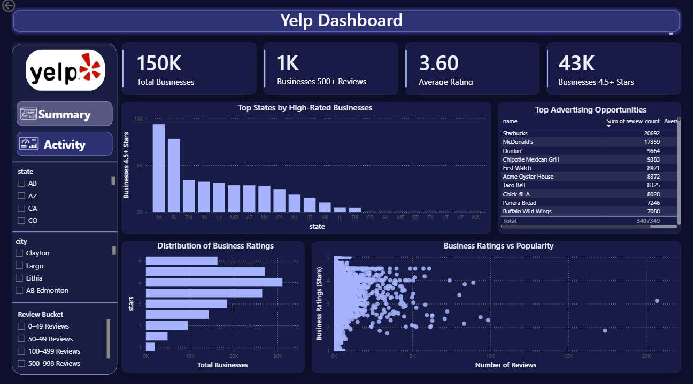
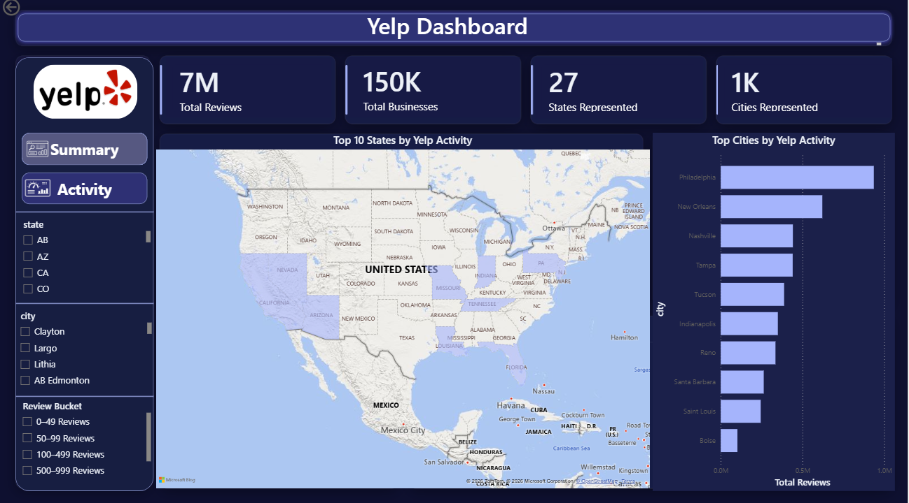

# Yelp Business Intelligence Dashboard

---

## Dashboard Previews

**Summary Page**

**Activity Page**

---

## Overview

**Objective:**
Analyze the Yelp Open Dataset to understand where business activity concentrates geographically and how customer ratings relate to review volume, supporting market-entry and advertising decisions.

This project analyzes 150K+ businesses and 7M+ customer reviews across 27 states and 1,000+ cities, combining SQL analysis with a 2-page interactive Power BI dashboard.

The work includes SQL data exploration and quality checks, data modeling, DAX measure development, and interactive dashboard design.

---

## Tools Used

* SQL (joins, aggregations, filtering, data quality checks — nulls, duplicates, invalid values)
* Power BI (data modeling, DAX measures, calculated columns, interactive visuals, Top N filtering)

---

## Data Pipeline
Raw Yelp Dataset

1.SQL Data Exploration & Validation
2.Data Cleaning & Quality Checks
3.Power BI Data Model
4.DAX Measures & Calculated Columns
5.Interactive Dashboard
6.Business Insights

---

## Workflow

1. **Explore & validate** — SQL queries against the Yelp business data: joins, aggregations, and filtering to profile the dataset, plus quality checks for nulls, duplicates, and invalid values
2. **Model** — a single 150,346-row detail table powers every visual, enabling instant cross-filtering across all pages (replaced static pre-aggregated tables that could not respond to slicers)
3. **Measures** — 7 DAX measures including Total Reviews, Total Businesses, States/Cities Represented, Average Rating, and threshold counts (500+ reviews, 4.5+ stars), plus calculated columns bucketing businesses by review volume
4. **Visualize** — a 2-page Power BI dashboard: KPI cards, a Top-N geographic map, ranked bar charts, and a ratings-vs-popularity scatter, all filterable by state, city, and review-volume bucket

---

## Dashboard Pages

**Summary** — portfolio-wide health: KPI cards, rating distribution, ratings vs. popularity scatter, top states by high-rated businesses, and top advertising opportunity businesses, filterable by state, city, and review-volume bucket

**Activity** — geographic engagement: KPI cards (7M+ reviews, 150K+ businesses), a Top 10 States by Yelp Activity map, and a Top Cities by Yelp Activity ranking

---

## Key Insights

* Yelp engagement is highly concentrated: the top 10 states account for the large majority of total review volume, led by Pennsylvania
* Philadelphia generates the most review activity of any city, ahead of New Orleans and Nashville
* Most businesses cluster between 3.5 and 4.5 stars — high review volume does not imply high ratings, and standout businesses (4.5+ stars with 500+ reviews) are a small identifiable segment
* Review volume is heavily skewed: the majority of businesses have fewer than 50 reviews, while a small group exceeds 1,000

---

## Files Included

* `yelp_business_dashboard.pbix` → Interactive Power BI dashboard (2 pages)
* `business_data.csv` → Cleaned dataset (150,346 businesses)
* `summary_page.png` / `activity_page.png` → Dashboard screenshots

---

## Business Impact

* Found the states and cities with the most Yelp activity — useful for deciding where to focus regionally
* Flagged businesses with both high ratings and high review volume as the strongest advertising targets
* Showed that review volume alone doesn't equal satisfaction — a heavily-reviewed business can still rate poorly
* Built the whole analysis on 150K+ real business records, filterable by state, city, and review-volume bucket

---

## Data Source

[Yelp Open Dataset](https://www.yelp.com/dataset) — business metadata subset
